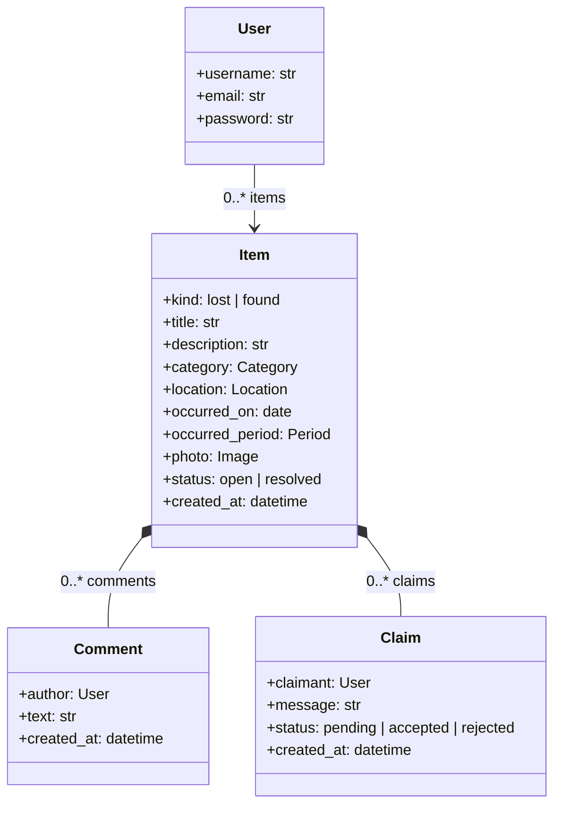
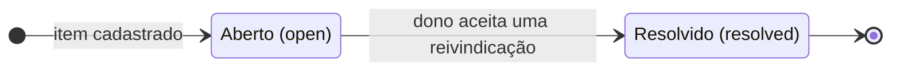
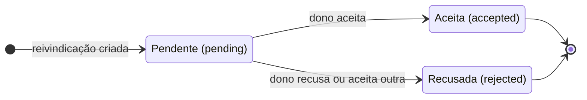

# Perdi e Achei - Sistema Web

## Membros do Grupo

| Nome completo | Papel |
|---|---|
| Fabricio Cagnoni | Full-stack |
| Luana Ribeiro Palhares | Full-stack |
| Mateus Mendes Alves Cabral | Full-stack |
| Paula D'agostini Alvares Maciel | Full-stack |

## Objetivo

O Perdi e Achei tem como objetivo facilitar a recuperação de itens perdidos dentro do campus universitário. Usuários podem cadastrar itens que perderam ou encontraram, informando categoria, local e foto, permitindo que outros membros da comunidade acadêmica identifiquem e reivindiquem seus pertences. A aplicação centraliza esse processo, que hoje costuma ocorrer de forma informal em grupos de WhatsApp ou murais físicos, tornando a busca mais rápida e organizada. O sistema permite comentar em itens, reivindicar a posse de um item e acompanhar o status das reivindicações.

## Tecnologias

- Linguagem: Python
- Framework: Django
- Banco de dados: SQLite
- Agentes de IA: Claude Code, Gemini

## Histórias de Usuário

1. Como usuário, quero me cadastrar e fazer login para acessar o sistema.
2. Como usuário, quero cadastrar um item perdido ou encontrado, com título, descrição, categoria, local e foto.
3. Como usuário, quero buscar e filtrar itens por categoria, local e status (aberto/resolvido).
4. Como usuário, quero comentar em um item para dar mais informações ou tirar dúvidas.
5. Como usuário, quero reivindicar um item ("isso é meu") para avisar formalmente o dono que aquele item pertence a mim.
6. Como dono de um item, quero ver as reivindicações recebidas e aceitar ou recusar cada uma, atualizando automaticamente o status do item para resolvido quando aceita.
7. Como usuário, quero ver um painel pessoal com meus itens cadastrados e minhas reivindicações feitas.
8. Como usuário, quero ver os itens mais recentes na página inicial ao acessar o sistema.
## Documentação UML

Documentação preliminar do sistema. Os diagramas refletem o model `Item` (US2) e o que está planejado nas issues para `Comment` (US4) e `Claim` (US5/US6). Eles serão ajustados conforme a implementação avançar.

### Diagrama de classes

Entidades persistidas no banco. `User` é o usuário padrão do `django.contrib.auth`. Cada usuário tem 0..* itens (campo `author` do `Item`), e comentários e reivindicações também apontam para um usuário (`author` e `claimant`). O losango preto (composição) indica que comentários e reivindicações pertencem a um único item e são apagados com ele. As listas completas de categorias, locais e turnos estão em `items/models.py`.



### Diagramas de estados

Ciclo de vida de um item e de uma reivindicação. Aceitar uma reivindicação resolve o item e recusa automaticamente as outras reivindicações pendentes dele (US6).





## Como executar

Pré-requisito: Python 3.12+.

```bash
python3 -m venv .venv
source .venv/bin/activate        # Windows: .venv\Scripts\activate
pip install -r requirements.txt
python manage.py migrate
python manage.py createsuperuser # opcional, para acessar /admin/
python manage.py runserver
```

O sistema fica disponível em http://127.0.0.1:8000/ e o painel administrativo em http://127.0.0.1:8000/admin/.
